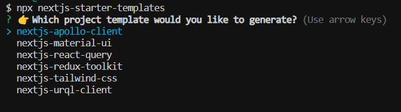
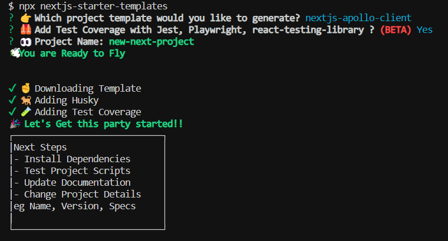

# NextJS Starter Template Cli 👋
[](https://www.npmjs.com/package/nextjs-starter-templates)
[](https://gitlab.com/nodeprojects4/nextjs-starter-templates)
[](#)

>  Simple Cli to Spin up Scalable & Robust NextJs Application, Beautifully architected for Great DX

### 🏠 [Homepage](https://gitlab.com/nodeprojects4/nextjs-starter-templates)

### ✨ [Demo](https://gitlab.com/nodeprojects4/nextjs-starter-templates)


## Usage

```sh
npx nextjs-starter-templates
```




## Author

👤 **wahid**

* Github: [@wahidzzz](https://github.com/wahidzzz)
* LinkedIn: [@wahid-shaikh-7b1416148](https://linkedin.com/in/wahid-shaikh-7b1416148)

## Show your support

Give a ⭐️ if this project helped you!
